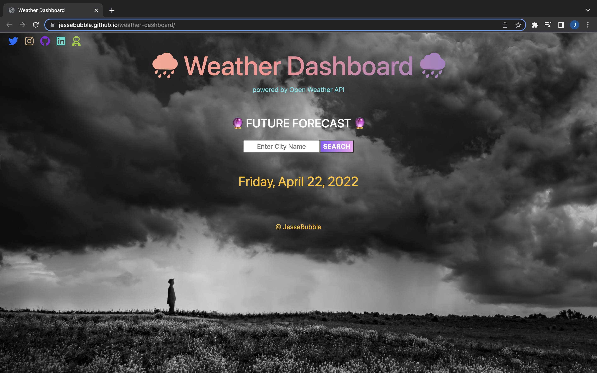

# Weather Dashboard 🌧️
- Javascript application powered by the OpenWeather API 
- USER will receive Current forcast and the 5-Day forcast for the city searched
* [View My Project](https://jessebubble.github.io/weather-dashboard/)

## Description 
- Build a weather dashboard that will run in the browser and feature dynamically updated `HTML` and `CSS`
- Use the `OpenWeather One Call API` to retrieve weather data for cities
- Use `localStorage` to store any persistent data.

## Resources
* [OpenWeather One Call API](https://openweathermap.org/api/one-call-api)
* [BootStrap](https://getbootstrap.com/)
* [Unsplash Image @ttrapani](https://unsplash.com/photos/6vXQrXVFXjI)
* [FireShip YouTube-CSS](https://www.youtube.com/c/Fireship)
  
## Sample

